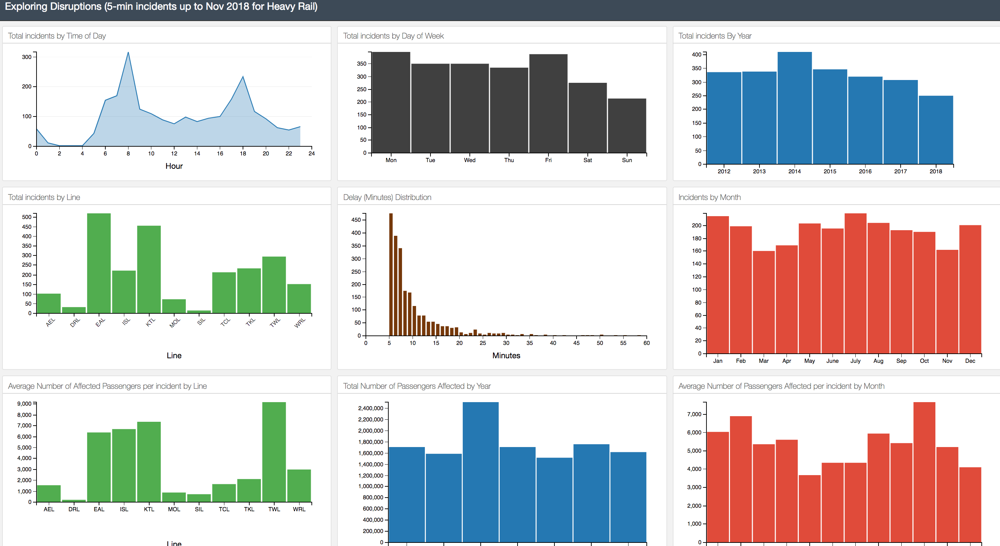

This is an interactive dashboard done with D3.js and DC.js to showcase the results of analysis decribed in 
Noursalehi, P., Koutsopoulos, H.N. and Zhao, J., 2020. Machine-learning-augmented analysis of textual data: application in transit disruption management. IEEE Open Journal of Intelligent Transportation Systems, 1, pp.227-236.

Run 
python app.py 

OR
python app_origin.py

